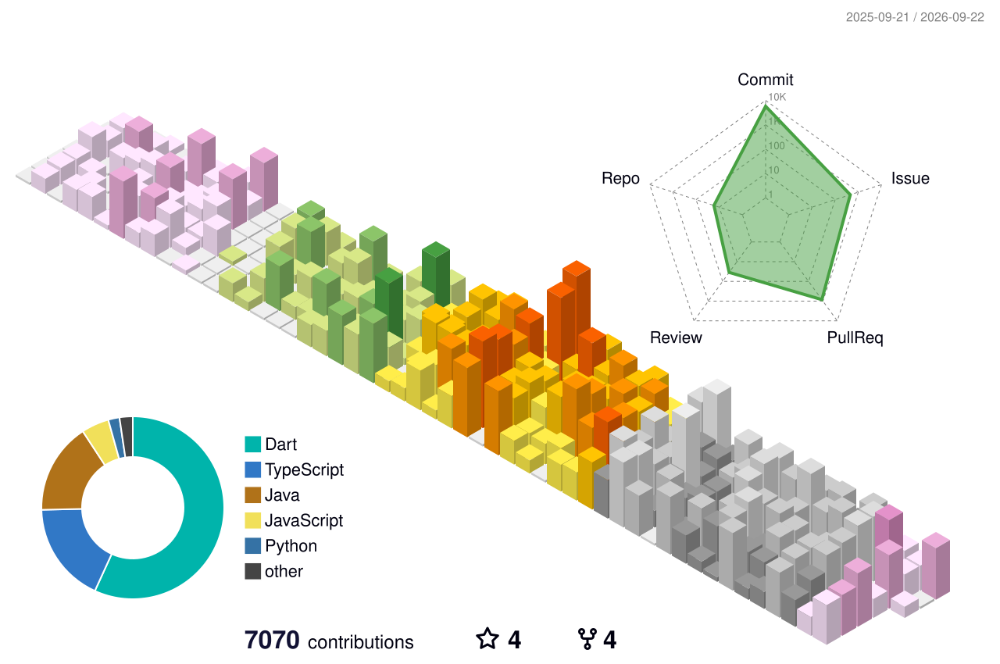

  
  <!--Header-->

[](https://git.io/typing-svg)

  # Hi, I'm Elipair! 👋
  
  ### 📱💻 Flutter Developer | Mobile & Web App Engineer
  
  I build delightful cross-platform experiences with **Flutter**  
  and craft smooth, user-friendly UIs.
  
   *"I follow my dream to make my dream."*
  <br>
  
  ---
  
  ## 🔥 About Me
  
  - 🎓 Sejong University (Computer Engineering 32nd)
  - 💻 Passionate about mobile, game, and web development
  - 🌟 Dreamer who codes with vision

  <br>

  ## 📜 Certifications

[](#)
  
  <br>
  
  ## 📬 Contact Me
  
  [](mailto:elipair0106@gmail.com)
  [](https://elipair.tistory.com/)
  [](https://instagram.com/e_m_hong)
  [](https://github.com/Elipair)
    <br>
</div>
    <br>
    
# 🛠️ Skills


## 🎨 Frontend
<p align="left">
  <a href="https://flutter.dev" target="_blank"></a>
  <a href="https://reactjs.org" target="_blank"></a>
  <a href="https://nextjs.org/" target="_blank"></a>
  <a href="https://www.typescriptlang.org/" target="_blank"></a>
  <a href="https://www.w3.org/html/" target="_blank"></a>
  <a href="https://www.w3schools.com/css/" target="_blank"></a>
</p>

## ⚙️ Backend
<p align="left">
  <a href="https://www.python.org" target="_blank"></a>
  <a href="https://www.java.com" target="_blank"></a>
  <a href="https://spring.io/" target="_blank"></a>
  <a href="https://git-scm.com/" target="_blank"></a>
</p>

## ☁️ Cloud & Infra
<p align="left">
  <a href="https://www.docker.com/" target="_blank"></a>
  <a href="https://vercel.com/" target="_blank"></a>
  <a href="https://www.oracle.com/cloud/" target="_blank"></a>
</p>


<br>

## ⏱️ Coding Activity (WakaTime)
<!--START_SECTION:elipair_waka-->


**🐱 저의 GitHub 정보에요.** 

> 📦 GitHub의 898.3 kB만큼의 저장소를 사용하고 있어요. 
 > 
> 🏆 5,341 만큼의 Contributions을 2026년에 했어요
 > 
> 🚫 구직중이지 않아요.
 > 
> 📜 34개의 Public Repository를 만들었어요. 
 > 
> 🔑 8개의 Private Repository를 만들었어요. 
 > 
**저는 저녁형 인간이에요. 🦉** 

```text
🌞 아침                     17197 commits       ⬛⬛⬛⬜⬜⬜⬜⬜⬜⬜⬜⬜⬜⬜⬜⬜⬜⬜⬜⬜⬜⬜⬜⬜⬜   10.76 % 
🌆 낮　                     54690 commits       ⬛⬛⬛⬛⬛⬛⬛⬛⬛⬜⬜⬜⬜⬜⬜⬜⬜⬜⬜⬜⬜⬜⬜⬜⬜   34.22 % 
🌃 저녁                     55351 commits       ⬛⬛⬛⬛⬛⬛⬛⬛⬛⬜⬜⬜⬜⬜⬜⬜⬜⬜⬜⬜⬜⬜⬜⬜⬜   34.63 % 
🌙 밤　                     32579 commits       ⬛⬛⬛⬛⬛⬜⬜⬜⬜⬜⬜⬜⬜⬜⬜⬜⬜⬜⬜⬜⬜⬜⬜⬜⬜   20.39 % 
```
📅 **제가 가장 생산적인 날은 목요일이에요.** 

```text
월요일                      23744 commits       ⬛⬛⬛⬛⬜⬜⬜⬜⬜⬜⬜⬜⬜⬜⬜⬜⬜⬜⬜⬜⬜⬜⬜⬜⬜   14.86 % 
화요일                      20985 commits       ⬛⬛⬛⬜⬜⬜⬜⬜⬜⬜⬜⬜⬜⬜⬜⬜⬜⬜⬜⬜⬜⬜⬜⬜⬜   13.13 % 
수요일                      23219 commits       ⬛⬛⬛⬛⬜⬜⬜⬜⬜⬜⬜⬜⬜⬜⬜⬜⬜⬜⬜⬜⬜⬜⬜⬜⬜   14.53 % 
목요일                      32733 commits       ⬛⬛⬛⬛⬛⬜⬜⬜⬜⬜⬜⬜⬜⬜⬜⬜⬜⬜⬜⬜⬜⬜⬜⬜⬜   20.48 % 
금요일                      29137 commits       ⬛⬛⬛⬛⬛⬜⬜⬜⬜⬜⬜⬜⬜⬜⬜⬜⬜⬜⬜⬜⬜⬜⬜⬜⬜   18.23 % 
토요일                      12835 commits       ⬛⬛⬜⬜⬜⬜⬜⬜⬜⬜⬜⬜⬜⬜⬜⬜⬜⬜⬜⬜⬜⬜⬜⬜⬜   08.03 % 
일요일                      17164 commits       ⬛⬛⬛⬜⬜⬜⬜⬜⬜⬜⬜⬜⬜⬜⬜⬜⬜⬜⬜⬜⬜⬜⬜⬜⬜   10.74 % 
```


📊 **저는 이번주를 이렇게 시간을 보냈어요.** 

```text
🕑︎ Timezone: Asia/Seoul

💬 프로그래밍 언어들: 
Markdown                 22 hrs 49 mins      ⬛⬛⬛⬛⬛⬛⬛⬛⬛⬛⬛⬛⬛⬜⬜⬜⬜⬜⬜⬜⬜⬜⬜⬜⬜   51.12 % 
Dart                     11 hrs 31 mins      ⬛⬛⬛⬛⬛⬛⬜⬜⬜⬜⬜⬜⬜⬜⬜⬜⬜⬜⬜⬜⬜⬜⬜⬜⬜   25.81 % 
Other                    2 hrs 9 mins        ⬛⬜⬜⬜⬜⬜⬜⬜⬜⬜⬜⬜⬜⬜⬜⬜⬜⬜⬜⬜⬜⬜⬜⬜⬜   04.84 % 
HTML                     1 hr 14 mins        ⬛⬜⬜⬜⬜⬜⬜⬜⬜⬜⬜⬜⬜⬜⬜⬜⬜⬜⬜⬜⬜⬜⬜⬜⬜   02.78 % 
YAML                     1 hr 12 mins        ⬛⬜⬜⬜⬜⬜⬜⬜⬜⬜⬜⬜⬜⬜⬜⬜⬜⬜⬜⬜⬜⬜⬜⬜⬜   02.69 % 

🔥 에디터들: 
Claude Code              26 hrs 45 mins      ⬛⬛⬛⬛⬛⬛⬛⬛⬛⬛⬛⬛⬛⬛⬛⬜⬜⬜⬜⬜⬜⬜⬜⬜⬜   59.92 % 
VS Code                  13 hrs 46 mins      ⬛⬛⬛⬛⬛⬛⬛⬛⬜⬜⬜⬜⬜⬜⬜⬜⬜⬜⬜⬜⬜⬜⬜⬜⬜   30.83 % 
Codex CLI                4 hrs 7 mins        ⬛⬛⬜⬜⬜⬜⬜⬜⬜⬜⬜⬜⬜⬜⬜⬜⬜⬜⬜⬜⬜⬜⬜⬜⬜   09.24 % 

🐱‍💻 프로젝트들: 
eodaego                  13 hrs 13 mins      ⬛⬛⬛⬛⬛⬛⬛⬜⬜⬜⬜⬜⬜⬜⬜⬜⬜⬜⬜⬜⬜⬜⬜⬜⬜   29.60 % 
cops_and_robbers         7 hrs 28 mins       ⬛⬛⬛⬛⬜⬜⬜⬜⬜⬜⬜⬜⬜⬜⬜⬜⬜⬜⬜⬜⬜⬜⬜⬜⬜   16.73 % 
festa                    5 hrs 11 mins       ⬛⬛⬛⬜⬜⬜⬜⬜⬜⬜⬜⬜⬜⬜⬜⬜⬜⬜⬜⬜⬜⬜⬜⬜⬜   11.62 % 
frontend                 4 hrs 47 mins       ⬛⬛⬛⬜⬜⬜⬜⬜⬜⬜⬜⬜⬜⬜⬜⬜⬜⬜⬜⬜⬜⬜⬜⬜⬜   10.74 % 
react-pokemon-ssr        4 hrs 26 mins       ⬛⬛⬜⬜⬜⬜⬜⬜⬜⬜⬜⬜⬜⬜⬜⬜⬜⬜⬜⬜⬜⬜⬜⬜⬜   09.93 % 

💻 운영 체제들: 
Mac                      44 hrs 39 mins      ⬛⬛⬛⬛⬛⬛⬛⬛⬛⬛⬛⬛⬛⬛⬛⬛⬛⬛⬛⬛⬛⬛⬛⬛⬛   100.00 % 
```

🤖 **AI Coding This Week** 

```text
⏱ AI Coding Time: 42 hrs 2 mins (94.14%)

✍️ 34,674 lines written by AI, 339 lines written by hand (99.03% AI-written)

🔤 1,235,707,734 Input Tokens, 4,448,918 Output Tokens

💵 $5535.91 Estimated AI Cost This Week

🧠 141 AI Sessions, 611 AI Prompts

Opus                     14,763 lines        ⬛⬛⬛⬛⬛⬛⬛⬛⬛⬛⬜⬜⬜⬜⬜⬜⬜⬜⬜⬜⬜⬜⬜⬜⬜   40.25 % 
Sonnet                   10,164 lines        ⬛⬛⬛⬛⬛⬛⬛⬜⬜⬜⬜⬜⬜⬜⬜⬜⬜⬜⬜⬜⬜⬜⬜⬜⬜   27.71 % 
Fable                    6,622 lines         ⬛⬛⬛⬛⬛⬜⬜⬜⬜⬜⬜⬜⬜⬜⬜⬜⬜⬜⬜⬜⬜⬜⬜⬜⬜   18.05 % 
Haiku                    4,191 lines         ⬛⬛⬛⬜⬜⬜⬜⬜⬜⬜⬜⬜⬜⬜⬜⬜⬜⬜⬜⬜⬜⬜⬜⬜⬜   11.43 % 
GPT                      938 lines           ⬛⬜⬜⬜⬜⬜⬜⬜⬜⬜⬜⬜⬜⬜⬜⬜⬜⬜⬜⬜⬜⬜⬜⬜⬜   02.56 % 

🔎 AI Coding Insights:
🤖 AI-Driven — 99.03% of written lines came from AI
📚 Verbose Prompter — average 4,444 characters per prompt
🔁 Iterative Prompter — average 4 prompts per session
🚀 High AI Trust — 1.74% of changed lines were hand-edited
```

**저는 주로 Dart 언어를 사용해요.** 

```text
TypeScript               11 repos            ⬛⬛⬛⬛⬛⬜⬜⬜⬜⬜⬜⬜⬜⬜⬜⬜⬜⬜⬜⬜⬜⬜⬜⬜⬜   19.30 % 
JavaScript               9 repos             ⬛⬛⬛⬛⬜⬜⬜⬜⬜⬜⬜⬜⬜⬜⬜⬜⬜⬜⬜⬜⬜⬜⬜⬜⬜   15.79 % 
Python                   7 repos             ⬛⬛⬛⬜⬜⬜⬜⬜⬜⬜⬜⬜⬜⬜⬜⬜⬜⬜⬜⬜⬜⬜⬜⬜⬜   12.28 % 
Java                     6 repos             ⬛⬛⬛⬜⬜⬜⬜⬜⬜⬜⬜⬜⬜⬜⬜⬜⬜⬜⬜⬜⬜⬜⬜⬜⬜   10.53 % 
Shell                    1 repo              ⬜⬜⬜⬜⬜⬜⬜⬜⬜⬜⬜⬜⬜⬜⬜⬜⬜⬜⬜⬜⬜⬜⬜⬜⬜   01.75 % 
```


 Last Updated on 2026년 08월 04일 20:34:47 UTC UTC
<!--END_SECTION:elipair_waka-->


---

## 📊 GitHub Stats



|  |  |
|---------------------------------------------------------------------------------------------------------------------------------------------------------------------------------------------------|---------------------------------------------------------------------------------------------------------------------------------------------------------------|
|                                                                                                                                     |                              |  
  
---

# 2026 Project

## 🚔🥷 경찰과도둑 
### 어릴 적 골목길 경찰과 도둑 놀이를 스마트폰 앱으로 더 편하고 재밌게 즐길 수 있도록만든 실시간 위치 기반 야외 게임 앱<br>

**세종대학교 SW중심대학 2026 세종 창업 아이디어 리그 - 대상** <br>
**2026 세종대학교 하반기 입주공모전 - 우수 창업 아이템상** <br>
**세종대학교 창업 동아리 SSUP - 선정** <br>
**2026년 세종대학교 중앙학술동아리 아롬 - 데모데이 특별상** <br><br>
**Tech:** Flutter, Riverpod, Dio/Retrofit, Google Maps · Naver Maps SDK, WebSocket(STOMP), Firebase(Auth/FCM/Analytics/Crashlytics) <br>
**CI/CD:** GitHub Actions, Fastlane <br>
**Deployment:** Google Play Store, Apple App Store
**Period:** 2025.10 ~ 2026~~ <br>

- [GitHub Repository](https://github.com/cops-and-robbers)<br>


  
---
### 🚀 우주공부선
학습/스터디 관리 플랫폼
스터디 목표 설정, 진행 기록, 공유 기능 중심으로 함께 공부 흐름을 만들 수 있는 서비스<br>
**Tech:** Flutter<br>
**Period:** 2026.01 ~ 2026~~
- [GitHub Repository](https://github.com/SpaceStudyShip/SpaceStudyShip-FE)
  
---

# 2025 Project


### 🏆 Stocker
**2025년 연합동아리 Seeds 팀 프로젝트 우수상** <br><br>
Team : "돔황촤 코스피" | 핀테크 주식투자 교육 앱 Stocker<br>
**Tech:** Flutter<br>
**Period:** 2025.05 ~ 2025.11
- [GitHub Repository](https://github.com/EM-H20/stocker)<br>
<br>
- [돔황차코스피_홍의민.pdf](https://github.com/user-attachments/files/26157168/_.pdf)

---

### 🏆 완익세종 (Wanik Sejong)
**2025년 제 13회 세종대학교 SW-AI 해커톤 장려상** <br><br>
Team : "완익고무 100점" | 웹사이트 완익세종  
**Tech:** React, Next.js  
**Period:** 2025.12.23 ~ 2025.12.24
- [GitHub Repository](https://github.com/Wanik-Sejong/Wanik-Sejong-FE)


---

### 🌍 트립게더 (Tripgether)
**세종대학교 창업캠프 대상, 제2회 신격호 롯데 청년기업가대상 본선 진출** <br><br>
**AI 기반 여행 가이드 플랫폼**  
SNS 게시물의 ‘공유’ 버튼 만으로 해당 게시물의 장소 정보를 정리해주는 앱 <br>
**Tech:** Flutter  
**Period:** 2025.09 ~ 2025.11  
- [GitHub Repository](https://github.com/EM-H20/Tripgether-FE)


---


### ⛪ 은샘침례교회 홈페이지 (Eunsaem Church Website)
Modern church website with a typed Next.js frontend and a Dockerized API layer.  
**Tech:** Next.js + TypeScript (frontend), Python FastAPI (backend), Docker, Oracle Cloud<br>
**Period:** 2025.07 ~ 2025.11

- [Visit Website](https://www.eunsaem.com/)
  


---

## 🚀 Featured Projects
### 🧱 Block Drag
A fast-paced, intuitive puzzle game to test your spatial skills.  
**Tech:** Flutter, Supabase  
**Period:** 2025.05 ~ 2025.07

- [Google Play Store](https://play.google.com/store/apps/details?id=com.elipair.blockdrag&pli=1)  
- [App Store](https://apps.apple.com/us/app/block-drag/id6745786081)
  


---

### 📝 Emotion Diary  
A clean and minimal diary app to track emotions and reflect on daily life.  
**Tech:** React  
**Period:** 2025.07 ~ 2025.08

- [Visit Website](https://emotion-diary-theta-eight.vercel.app/)
  
  
  
---
### 📖 RuleBook  
Quickly browse, bookmark, and search rulebooks for your favorite games.  
**Tech:** Flutter 
**Period:** 2025.03 ~ 2025.06
- [Google Play Store](https://play.google.com/store/apps/details?id=com.elipair.rulebook)  
- [App Store](https://apps.apple.com/us/app/%EB%A3%B0%EB%B6%81-rulebook/id6745808744)
  


---
### 🌐 냥생뭐였니? (Nyangseng Project)
A playful cat-themed web experience built with Next.js  
**Tech:** Next.js  
**Period:** 2024.11 ~ 2024.12

- [Visit Website](https://nyangseng-git-main-em-h20s-projects.vercel.app/)
  


---

### 🤖 플래닝 (Discord Bot)
A Lost Ark information bot for Discord communities  
**Tech:** Python, Oracle Cloud  
**Period:** 2024.11 ~ 2024.12  
- Deployed on Oracle Cloud infrastructure  
- Provides real-time Lost Ark game information and updates  

<div align="start" style="display: flex; flex-direction: column; align-items: center;">


<br />


</div>

---
